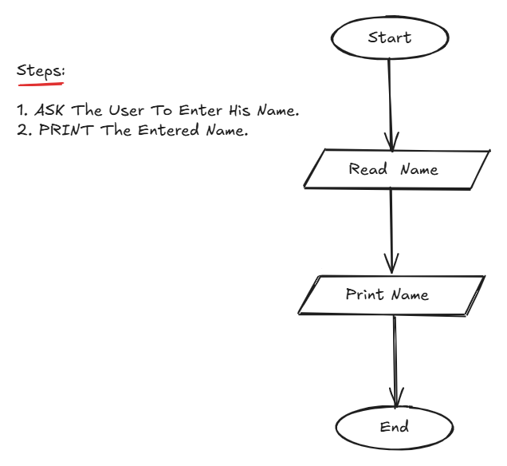

## Problem 2 - Print User Name

### Problem

Write a program to ask the user to enter his/her name and print it on the screen.

### Algorithm

1. Start.
2. Ask the user to enter his/her name.
3. Read and store the entered name.
4. Print the entered name.
5. End.

### Flowchart

