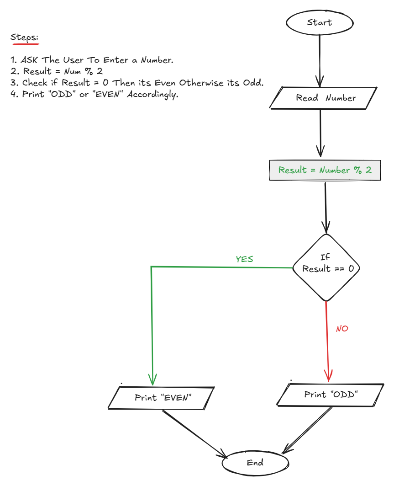

## Problem 3 - Check Even or Odd

### Problem

Write a program to ask the user to enter a number, then print `"ODD"` if it is odd, or `"Even"` if it is even.

### Algorithm

1. Start.
2. Ask the user to enter a number.
3. Calculate `Result = Num mod 2`.
4. Check if `Result = 0`.
5. If `Result = 0`, print `"Even"`.
6. Otherwise, print `"ODD"`.
7. End.

### Flowchart

