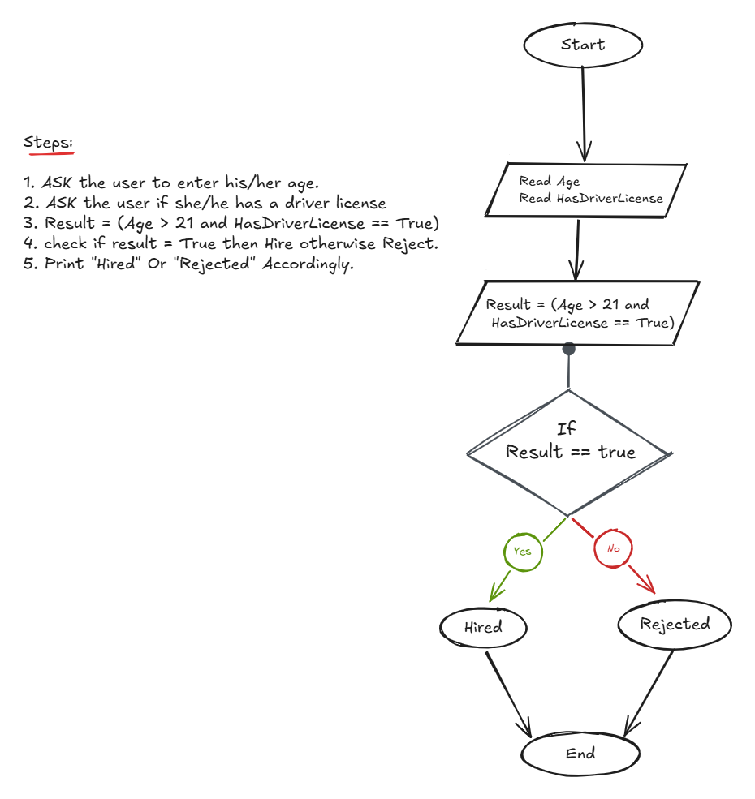

## Problem 4 - Hire a Driver

### Problem

Write a program to ask the user to enter his/her:

* Age
* Driver license

Then print `"Hired"` if his/her age is greater than 21 **and** he/she has a driver license; otherwise, print `"Rejected"`.

### Algorithm

1. Start.
2. Ask the user to enter his/her age.
3. Ask the user if he/she has a driver license.
4. Calculate `Result = (Age > 21 AND HasDriverLicense = True)`.
5. Check if `Result = True`.
6. If `Result = True`, print `"Hired"`.
7. Otherwise, print `"Rejected"`.
8. End.

### Flowchart

