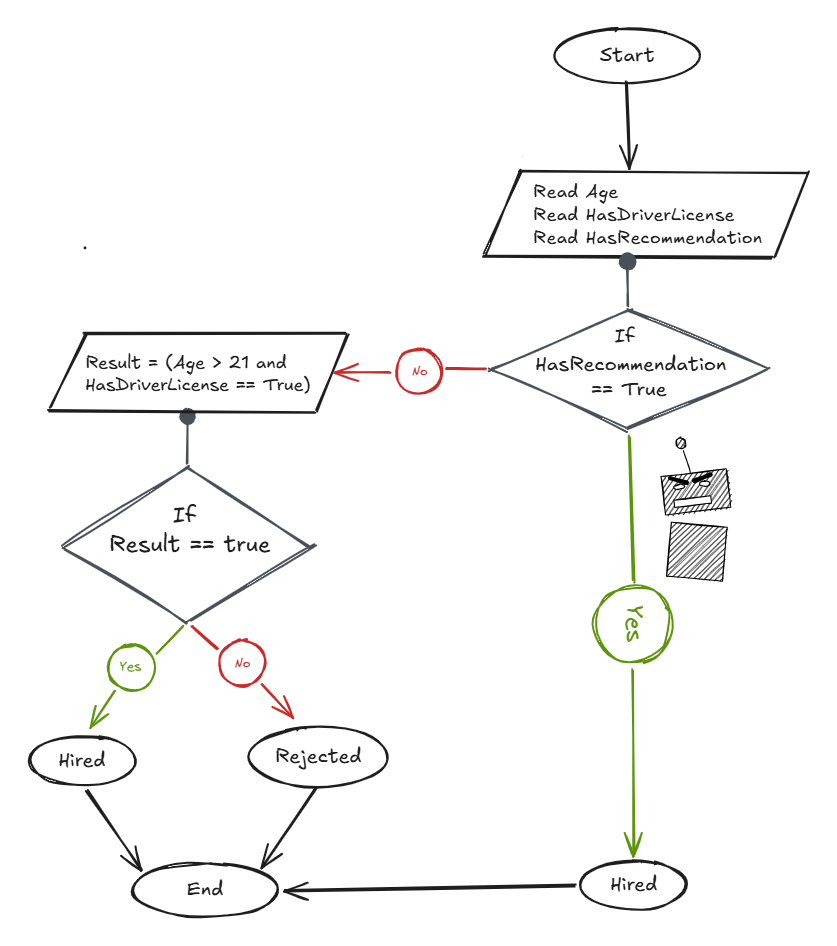

## Problem 5 - Hire a Driver - Case 2

### Problem

Write a program to ask the user to enter his/her:

* Age
* Driver license
* Has Recommendation

Then print `"Hired"` if his/her age is greater than 21 and he/she has a driver license, otherwise print `"Rejected"`, **or hire him/her without conditions if he/she has a recommendation.**

### Algorithm

1. Start.
2. Ask the user to enter his/her age.
3. Ask the user if he/she has a driver license.
4. Ask the user if he/she has a recommendation.
5. Check if `HasRecommendation = True`.
6. If `HasRecommendation = True`, print `"Hired"`.
7. Otherwise, calculate `Result = (Age > 21 AND HasDriverLicense = True)`.
8. Check if `Result = True`.
9. If `Result = True`, print `"Hired"`.
10. Otherwise, print `"Rejected"`.
11. End.

### Flowchart

