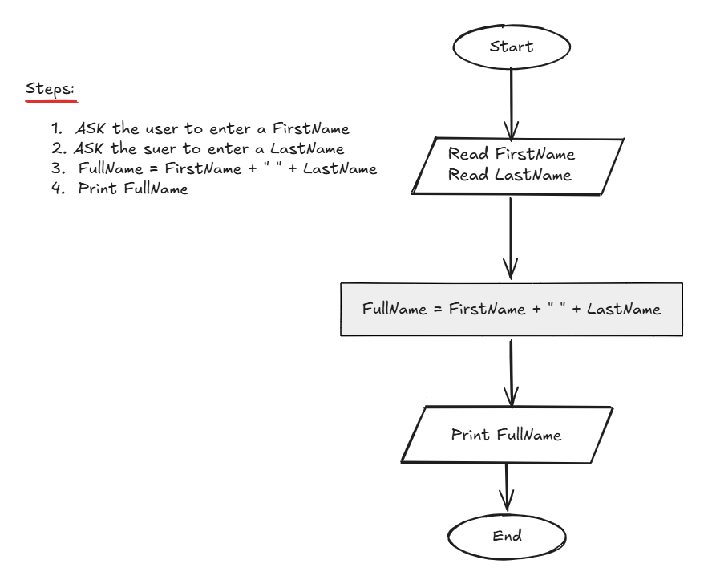

## Problem 6 - Full Name

### Problem

Write a program to ask the user to enter:

- First Name
- Last Name

Then print the Full Name on the screen.

**Example Input:**
`Ahmed` `Aboalazayem`

**Output:**
`Ahmed Aboalazayem`

### Algorithm

1. Start.
2. Ask the user to enter a `FirstName`.
3. Ask the user to enter a `LastName`.
4. Calculate `FullName = FirstName + " " + LastName`.
5. Print `FullName`.
6. End.

### Flowchart

