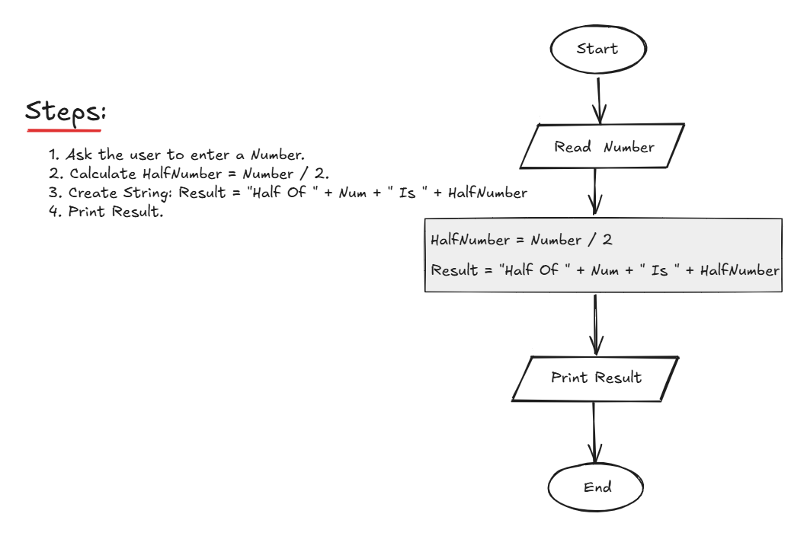

## Problem 7 - Half Number

### Problem

Write a program to ask the user to enter:

* Number

Then print `"Half of [Number] is [HalfNumber]"`.

**Example Input:**
`60`
`50`

**Output:**
`Half of 60 is 30`
`Half of 50 is 25`

### Algorithm

1. Start.
2. Ask the user to enter `Num`.
3. Calculate `HalfNumber = Num / 2`.
4. Calculate `Result = "Half of " + Num + " is " + HalfNumber`.
5. Print `Result`.
6. End.

### Flowchart

