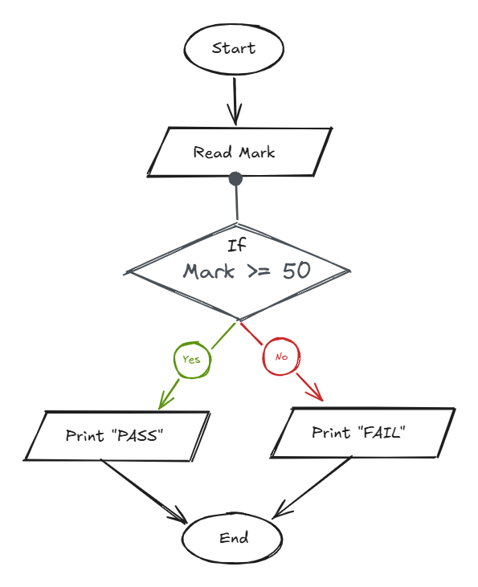

## Problem 8 - Pass Fail

### Problem

Write a program to ask the user to enter:

- Mark

Then print `"PASS"` if `Mark >= 50`, otherwise print `"Fail"`.

**Example Input:**
`45`

**Output:**
`Fail`

### Algorithm

1. Start.
2. Ask the user to enter `Mark`.
3. Check if `Mark >= 50`.
4. If `Mark >= 50`, print `"PASS"`.
5. Otherwise, print `"Fail"`.
6. End.

### Flowchart

