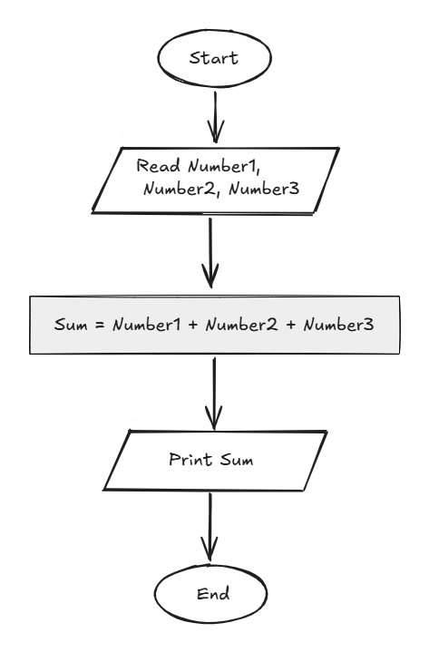

## Problem 9 - Sum of 3 Numbers

### Problem

Write a program to ask the user to enter:

- Number1
- Number2
- Number3

Then print the sum of the entered numbers.

**Example Input:**
`10`
`20`
`30`

**Output:**
`60`

### Algorithm

1. Start.
2. Ask the user to enter `Num1`, `Num2`, and `Num3`.
3. Calculate `Sum = Num1 + Num2 + Num3`.
4. Print `Sum`.
5. End.

### Flowchart

