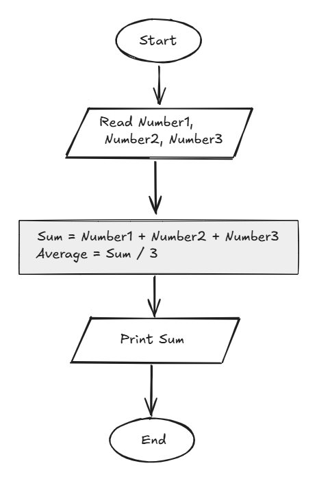

## Problem 10 - Average of 3 Marks

### Problem

Write a program to ask the user to enter three marks, then calculate and print their average.

- **Inputs:** `Mark1`, `Mark2`, `Mark3`
- **Output:** The average of the three marks
- **Example Input:** `90`, `80`, `70`
- **Example Output:** `80`

### Algorithm

1. Start.
2. Read `Mark1`, `Mark2`, and `Mark3`.
3. Calculate the average:  
   `Avg = (Mark1 + Mark2 + Mark3) / 3`
4. Print `Avg`.
5. End.

### Flowchart

