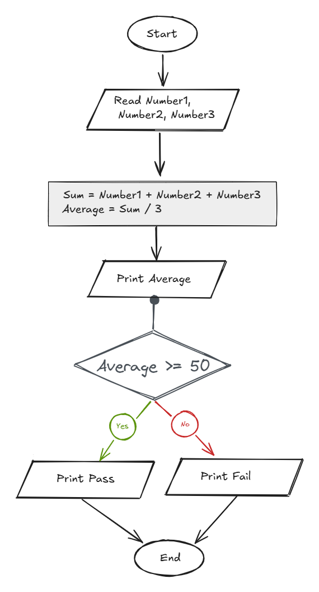

## Problem 11 - Average Pass Fail

### Problem

Write a program to ask the user to enter three marks, then calculate and print their average. Print `"PASS"` if the average is greater than or equal to `50`; otherwise, print `"FAIL"`.

- **Inputs:** `Mark1`, `Mark2`, `Mark3`
- **Output:** The average and `"PASS"` or `"FAIL"`
- **Example Input:** `90`, `80`, `70`
- **Example Output:** `80`, `PASS`

### Algorithm

1. Start.
2. Read `Mark1`, `Mark2`, and `Mark3`.
3. Calculate the average:  
   `Avg = (Mark1 + Mark2 + Mark3) / 3`
4. Print `Avg`.
5. Check if `Avg >= 50`.
    - **Yes:** Print `"PASS"`.
    - **No:** Print `"FAIL"`.

6. End.

### Flowchart

