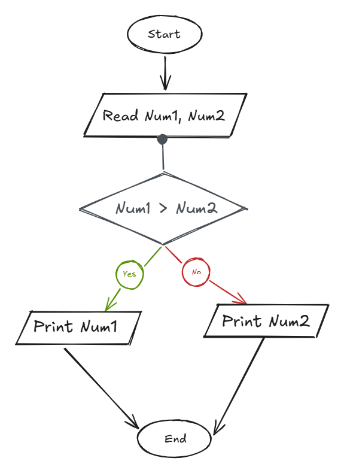

## Problem 12 - Max of 2 Numbers

### Problem

Write a program to ask the user to enter two numbers, then print the maximum number.

- **Inputs:** `Num1`, `Num2`
    
- **Output:** The maximum number
    
- **Example Input:** `10`, `20`
    
- **Example Output:** `20`
    

### Algorithm

1. Start.
    
2. Read `Num1` and `Num2`.
    
3. Check if `Num1 > Num2`.
    
    - **Yes:** Print `Num1`.
        
    - **No:** Print `Num2`.
        
4. End.
    

### Flowchart

v