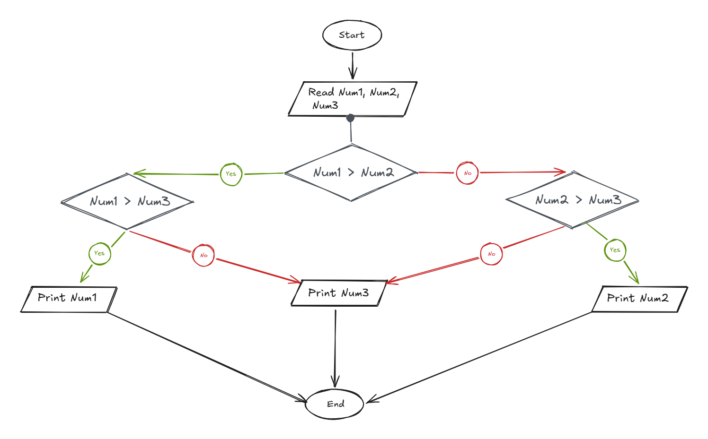

## Problem 13 - Max of 3 Numbers

### Problem

Write a program to ask the user to enter three numbers, then print the maximum number.

- **Inputs:** `Num1`, `Num2`, `Num3`
    
- **Output:** The maximum number
    
- **Example Input:** `30`, `10`, `20`
    
- **Example Output:** `30`
    

### Algorithm

1. Start.
    
2. Read `Num1`, `Num2`, and `Num3`.
    
3. Check if `Num1 > Num2`.
    
    - **Yes:** Check if `Num1 > Num3`.
        
        - **Yes:** Print `Num1`.
            
        - **No:** Print `Num3`.
            
    - **No:** Check if `Num2 > Num3`.
        
        - **Yes:** Print `Num2`.
            
        - **No:** Print `Num3`.
            
4. End.
    

### Flowchart

