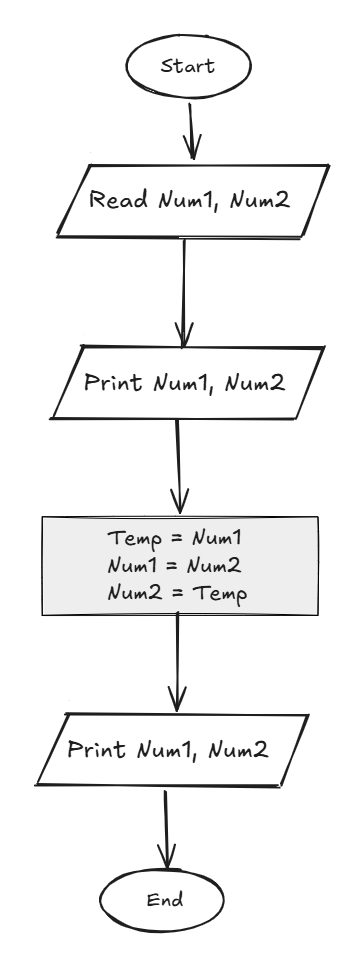

## Problem 14 - Swap Numbers

### Problem

Write a program to ask the user to enter two numbers, then print the two numbers, swap them, and print them again.

- **Inputs:** `Num1`, `Num2`
    
- **Output:** The two numbers before and after swapping
    
- **Example Input:** `10`, `20`
    
- **Example Output:**
    
    - Before: `10`, `20`
        
    - After: `20`, `10`
        

### Algorithm

1. Start.
    
2. Read `Num1` and `Num2`.
    
3. Print `Num1`.
    
4. Print `Num2`.
    
5. Store `Num1` in `Temp`:  
    `Temp = Num1`
    
6. Assign `Num2` to `Num1`:  
    `Num1 = Num2`
    
7. Assign `Temp` to `Num2`:  
    `Num2 = Temp`
    
8. Print `Num1`.
    
9. Print `Num2`.
    
10. End.
    

### Flowchart

