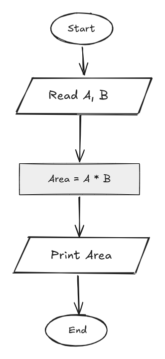

## Problem 15 - Rectangle Area

### Problem

Write a program to calculate the area of a rectangle and print it on the screen.

- **Inputs:** `Length`, `Width`
    
- **Output:** The rectangle area
    
- **Example Input:** `10`, `20`
    
- **Example Output:** `200`
    

### Algorithm

1. Start.
    
2. Read `Length` and `Width`.
    
3. Calculate the area:  
    `Area = Length * Width`
    
4. Print `Area`.
    
5. End.
    

### Flowchart

