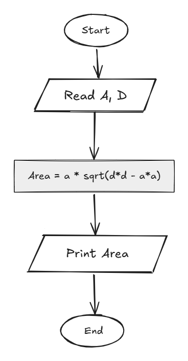

## Problem 16 - Rectangle Area Through Diagonal and Side

### Problem

Write a program to calculate the area of a rectangle using its diagonal and one side, then print the area.

- **Inputs:** `a` (side), `d` (diagonal)
    
- **Output:** The rectangle area
    
- **Formula:** `Area = a * sqrt(d * d - a * a)`
    
- **Example Input:** `5`, `40`
    
- **Example Output:** `198.431`
    

### Algorithm

1. Start.
    
2. Read `a` and `d`.
    
3. Calculate the area:  
    `Area = a * sqrt(d * d - a * a)`
    
4. Print `Area`.
    
5. End.
    

### Flowchart

