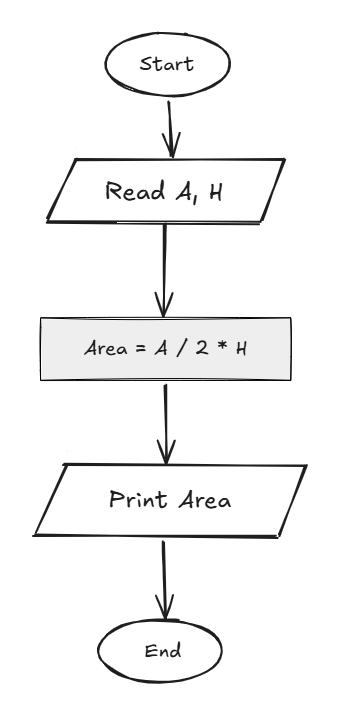

## Problem 17 - Triangle Area

### Problem

Write a program to calculate the area of a triangle and print it on the screen.

- **Inputs:** `a` (base), `h` (height)
    
- **Output:** The triangle area
    
- **Formula:** `Area = (a / 2) * h`
    
- **Example Input:** `10`, `8`
    
- **Example Output:** `40`
    

### Algorithm

1. Start.
    
2. Read `a` and `h`.
    
3. Calculate the area:  
    `Area = (a / 2) * h`
    
4. Print `Area`.
    
5. End.
    

### Flowchart

