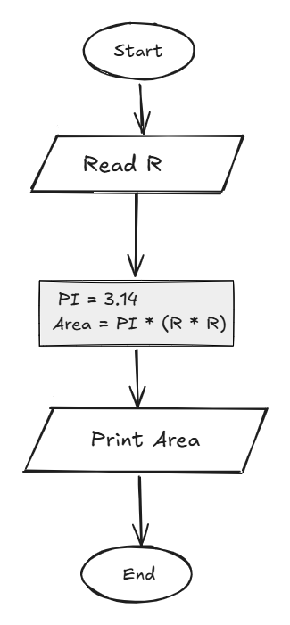

## Problem 18 - Circle Area

### Problem

Write a program to calculate the area of a circle and print it on the screen.

- **Input:** `r` (radius)
- **Output:** The circle area
- **Formula:** `Area = PI * (r * r)`
- **PI:** `3.14`
- **Example Input:** `5`
- **Example Output:** `78.54`

### Algorithm

1. Start.
2. Read `r`.
3. Set `PI = 3.14`.
4. Calculate the area:  
   `Area = PI * (r * r)`
5. Print `Area`.
6. End.

### Flowchart

