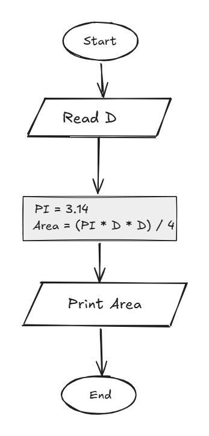

## Problem 19 - Circle Area Through Diameter

### Problem

Write a program to calculate the area of a circle using its diameter, then print the area on the screen.

- **Input:** `D` (diameter)
    
- **Output:** The circle area
    
- **Formula:** `Area = (PI * D * D) / 4`
    
- **PI:** `3.14`
    
- **Example Input:** `10`
    
- **Example Output:** `78.54`
    

### Algorithm

1. Start.
    
2. Read `D`.
    
3. Set `PI = 3.14`.
    
4. Calculate the area:  
    `Area = (PI * D * D) / 4`
    
5. Print `Area`.
    
6. End.
    

### Flowchart

