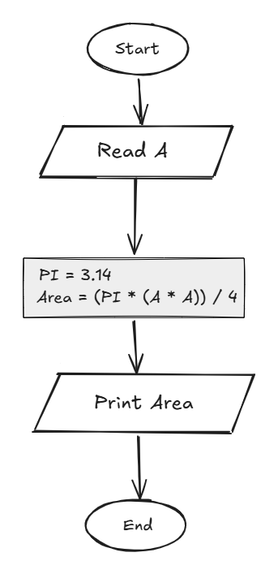

## Problem 20 - Circle Area Inscribed in a Square

### Problem

Write a program to calculate the area of a circle inscribed in a square, then print the area on the screen.

- **Input:** `A` (side length of the square)
- **Output:** The circle area
- **Formula:** `Area = (PI * (A * A)) / 4`
- **PI:** `3.14`
- **Example Input:** `10`
- **Example Output:** `78.54`

### Algorithm

1. Start.
2. Read `A`.
3. Set `PI = 3.14`.
4. Calculate the area:  
   `Area = (PI * (A * A)) / 4`
5. Print `Area`.
6. End.

### Flowchart

