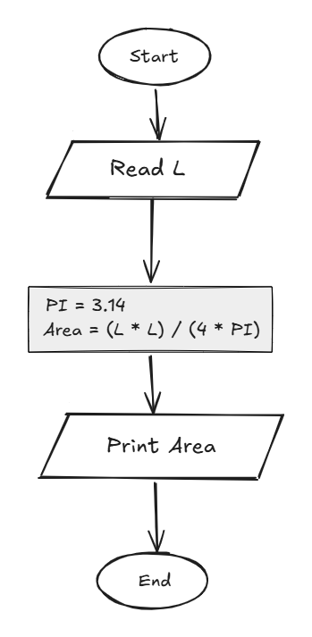

## Problem 21 - Circle Area Along the Circumference

### Problem

Write a program to calculate the area of a circle using its circumference, then print the area on the screen.

- **Input:** `L` (circumference)
    
- **Output:** The circle area
    
- **Formula:** `Area = (L * L) / (4 * PI)`
    
- **PI:** `3.14`
    
- **Example Input:** `20`
    
- **Example Output:** `31.831`
    

### Algorithm

1. Start.
    
2. Read `L`.
    
3. Set `PI = 3.14`.
    
4. Calculate the area:  
    `Area = (L * L) / (4 * PI)`
    
5. Print `Area`.
    
6. End.
    

### Flowchart

