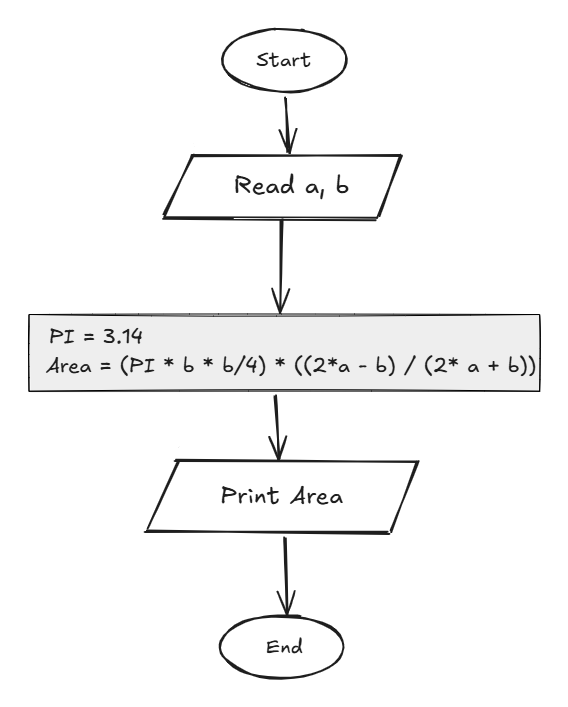

## Problem 22 - Circle Area Inscribed in an Isosceles Triangle

### Problem

Write a program to calculate the area of a circle inscribed in an isosceles triangle, then print the area on the screen.

- **Inputs:** `a`, `b`
    
- **Output:** The circle area
    
- **Formula:** `Area = (PI * b * b / 4) * ((2 * a - b) / (2 * a + b))`
    
- **PI:** `3.14`
    
- **Example Input:** `20`, `10`
    
- **Example Output:** `47.124`
    

### Algorithm

1. Start.
    
2. Read `a` and `b`.
    
3. Set `PI = 3.14`.
    
4. Calculate the area:  
    `Area = (PI * b * b / 4) * ((2 * a - b) / (2 * a + b))`
    
5. Print `Area`.
    
6. End.
    

### Flowchart

