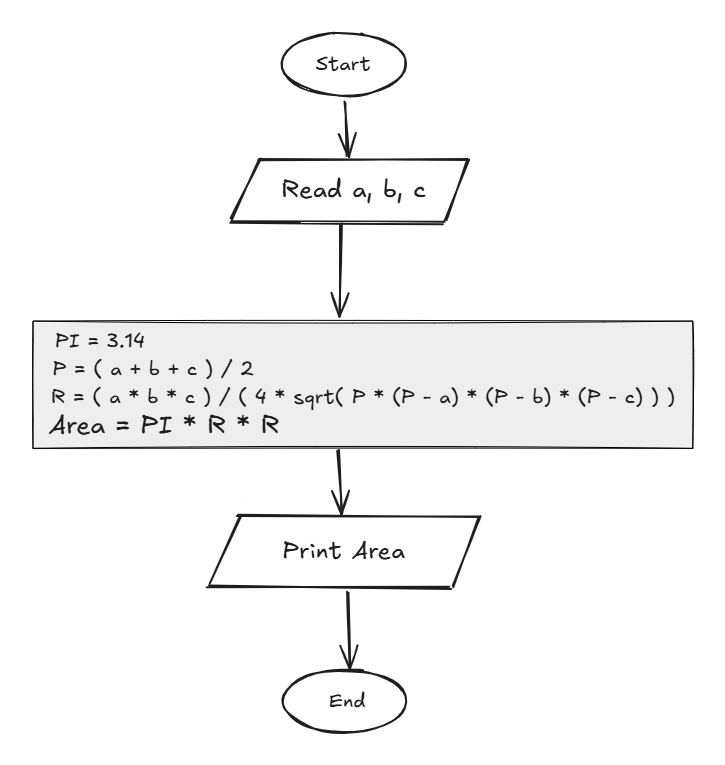

## Problem 23 - Circle Area Described Around an Arbitrary Triangle

### Problem

Write a program to calculate the area of a circle described around an arbitrary triangle, then print the area on the screen.

- **Inputs:** `a`, `b`, `c` (triangle sides)
    
- **Output:** The area of the circumscribed circle
    
- **Formula:**
    
    - `P = (a + b + c) / 2`
        
    - `T = (a * b * c) / (4 * sqrt(P * (P - a) * (P - b) * (P - c)))`
        
    - `Area = PI * T * T`
        
- **PI:** `3.14`
    
- **Example Input:** `5`, `6`, `7`
    
- **Example Output:** `40.088`
    

### Algorithm

1. Start.
    
2. Read `a`, `b`, and `c`.
    
3. Set `PI = 3.14`.
    
4. Calculate the semi-perimeter:  
    `P = (a + b + c) / 2`
    
5. Calculate `T`:  
    `T = (a * b * c) / (4 * sqrt(P * (P - a) * (P - b) * (P - c)))`
    
6. Calculate `T * T`:  
    `T = T * T`
    
7. Calculate the circle area:  
    `Area = PI * T`
    
8. Print `Area`.
    
9. End.
    

### Flowchart

