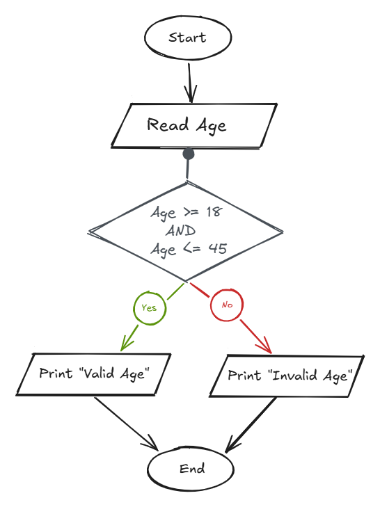

## Problem 24 - Validate Age Between 18 and 45

### Problem

Write a program to ask the user to enter their age. If the age is between `18` and `45` inclusive, print `"Valid Age"`; otherwise, print `"Invalid Age"`.

- **Input:** `Age`
    
- **Output:** `"Valid Age"` or `"Invalid Age"`
    

### Algorithm

1. Start.
    
2. Read `Age`.
    
3. Calculate the result:  
    `Result = (Age >= 18 && Age <= 45)`
    
4. Check if `Result` is `True`.
    
    - **Yes:** Print `"Valid Age"`.
        
    - **No:** Print `"Invalid Age"`.
        
5. End.
    

### Flowchart

