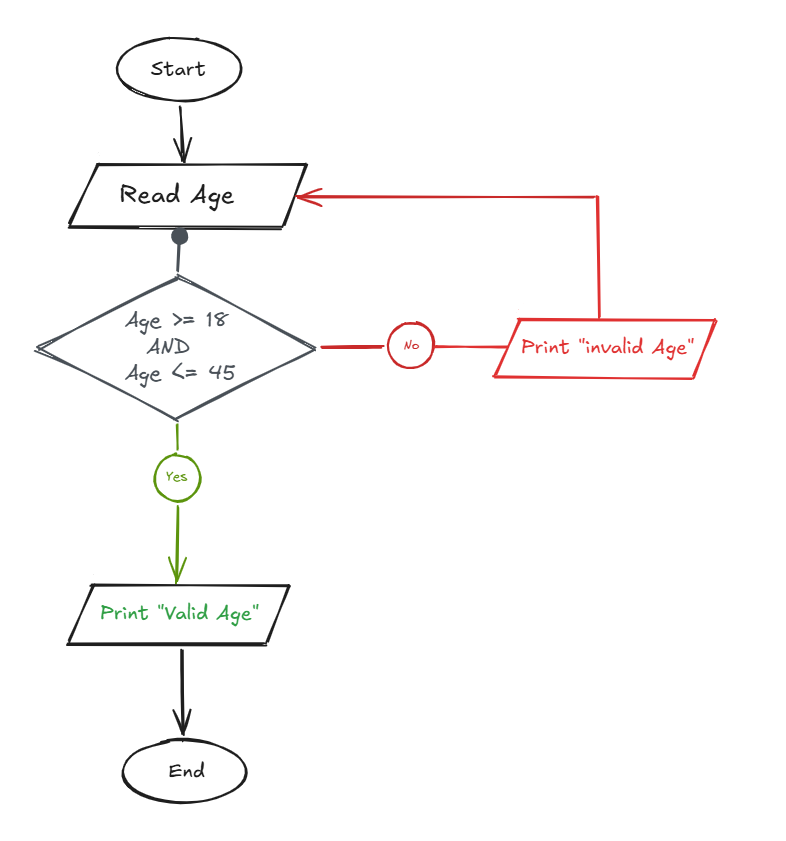

## Problem 25 - Read Until Age Between 18 and 45

### Problem

Write a program to ask the user to enter an age. If the age is between `18` and `45` inclusive, print `"Valid Age"`. Otherwise, print `"Invalid Age"` and ask the user to enter another age.

Keep asking the user to enter an age until a valid age is entered.

- **Input:** `Age`
    
- **Output:** `"Valid Age"` when the entered age is between `18` and `45`; otherwise, `"Invalid Age"` and repeat the input.
    

### Algorithm

1. Start.
    
2. Read `Age`.
    
3. Check if `Age >= 18 && Age <= 45`.
    
    - **Yes:** Print `"Valid Age"` and continue to step 5.
        
    - **No:** Print `"Invalid Age"` and go back to step 2.
        
4. Repeat until a valid age is entered.
    
5. End.
    

### Flowchart

