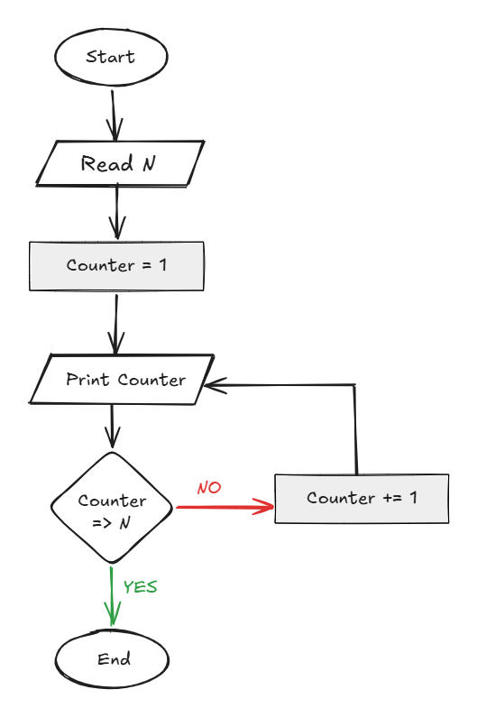

## Problem 26 - Print Numbers from 1 to N

### Problem

Write a program to print all numbers from `1` to `N`.

- **Input:** `N`
    
- **Output:** Numbers from `1` to `N`
    
- **Example Input:** `10`
    
- **Example Output:** `1 2 3 4 5 6 7 8 9 10`
    

### Algorithm

1. Start.
    
2. Read `N`.
    
3. Set `Counter = 1`.
    
4. Print `Counter` Value.
    
5. Check if `Counter >= N`.
    
    - **Yes:** End.
        
    - **No:** 6. Counter += 1, GO TO Step 4.
        
7. End.
    

### Flowchart

