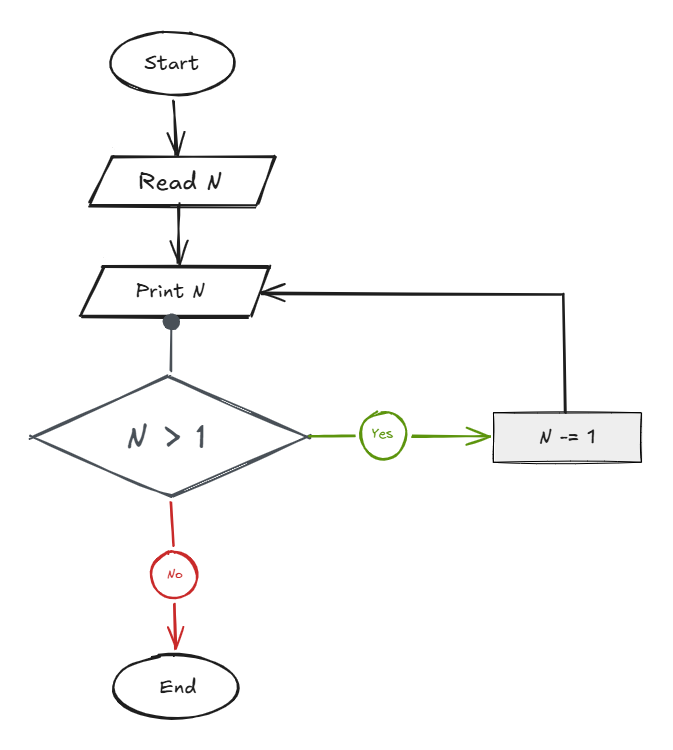

## Problem 27 - Print Numbers from N to 1

### Problem

Write a program to print all numbers from `N` down to `1`.

- **Input:** `N`
    
- **Output:** Numbers from `N` to `1`
    
- **Example Input:** `10`
    
- **Example Output:** `10 9 8 7 6 5 4 3 2 1`
    

### Algorithm

1. Start.
    
2. Read `N`.
    
3. Set `Counter = N + 1`.
    
4. Decrease `Counter` by `1`.
    
5. Print `Counter`.
    
6. Check if `Counter == 1`.
    
    - **Yes:** End.
        
    - **No:** Go back to step 4.
        
7. End.
    

### Flowchart

