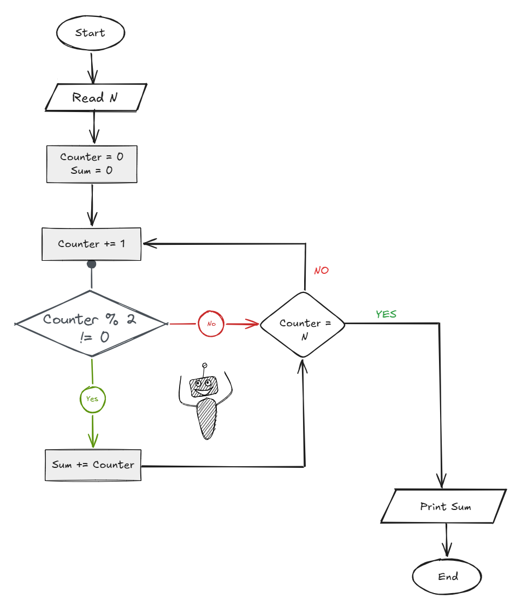

## Problem 28 - Sum Odd Numbers from 1 to N

### Problem

Write a program to calculate the sum of all odd numbers from `1` to `N`.

- **Input:** `N`
    
- **Output:** The sum of all odd numbers from `1` to `N`
    
- **Example Input:** `10`
    
- **Example Output:** `25`
    

### Algorithm

1. Start.
    
2. Read `N`.
    
3. Set `Counter = 0`.
    
4. Set `Sum = 0`.
    
5. Increase `Counter` by `1`.
    
6. Check if `Counter % 2 != 0`.
    
    - **Yes:** Add `Counter` to `Sum`:  
        `Sum = Sum + Counter`
        
    - **No:** Continue.
        
7. Check if `Counter == N`.
    
    - **Yes:** Print `Sum` and end.
        
    - **No:** Go back to step 5.
        
8. End.
    

### Flowchart

