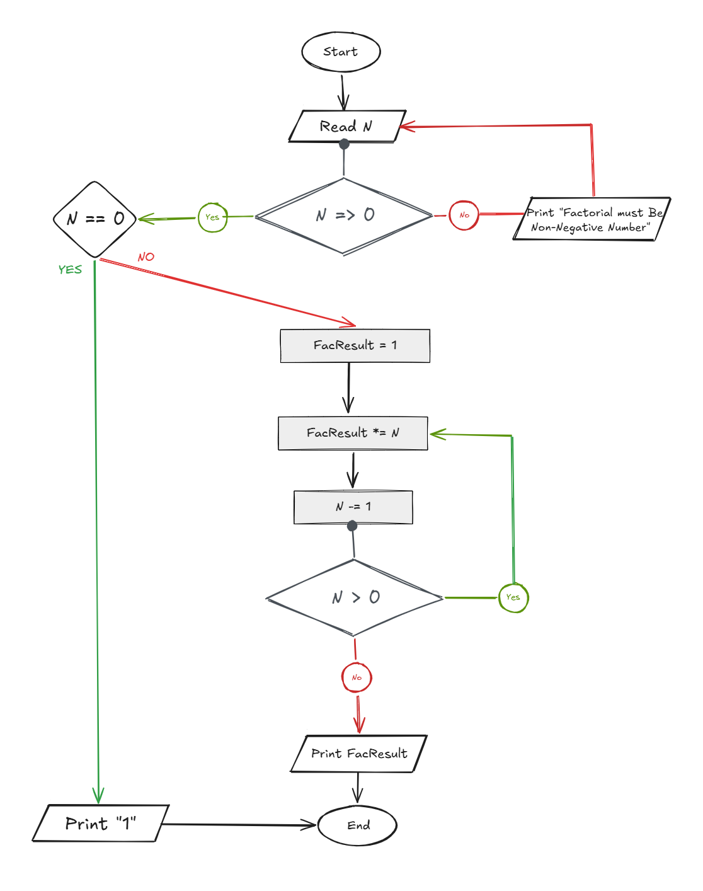

## Problem 30 - Factorial of N!

### Problem

Write a program to calculate the factorial of `N`.

The user should enter a positive number. If the entered number is not positive, print an error message and ask the user to enter another number.

- **Input:** `N`
    
- **Output:** `N!`
    
- **Example:** `6! = 6 × 5 × 4 × 3 × 2 × 1 = 720`
    
- **Example Input:** `6`
    
- **Example Output:** `720`
    

### Algorithm

1. Start.
    
2. Read `N`.
    
3. Check if `N <= 0`.
    
    - **Yes:** Print `"Factorial Must be Positive Number"` and go back to step 2.
        
    - **No:** Continue.
        
4. Set `Counter = N + 1`.
    
5. Set `Factorial = 1`.
    
6. Decrease `Counter` by `1`.
    
7. Calculate:  
    `Factorial = Factorial * Counter`
    
8. Check if `Counter == 1`.
    
    - **Yes:** Print `Factorial` and end.
        
    - **No:** Go back to step 6.
        
9. End.
    

### Flowchart

