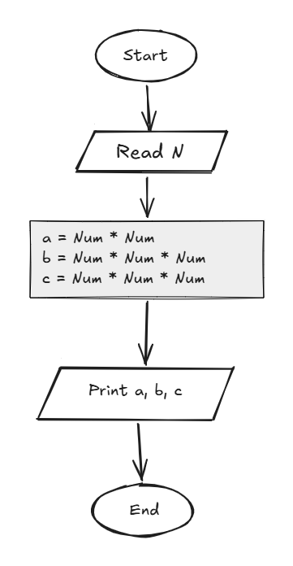

## Problem 31 - Power of 2, 3, 4

### Problem

Write a program to ask the user to enter a number, then calculate and print the number raised to the powers of `2`, `3`, and `4`.

- **Input:** `Num`
    
- **Output:** `Num²`, `Num³`, and `Num⁴`
    
- **Example Input:** `3`
    
- **Example Output:** `9 27 81`
    

### Algorithm

1. Start.
    
2. Read `Num`.
    
3. Calculate the second power:  
    `A = Num * Num`
    
4. Calculate the third power:  
    `B = Num * Num * Num`
    
5. Calculate the fourth power:  
    `C = Num * Num * Num * Num`
    
6. Print `A`, `B`, and `C`.
    
7. End.
    

### Flowchart

