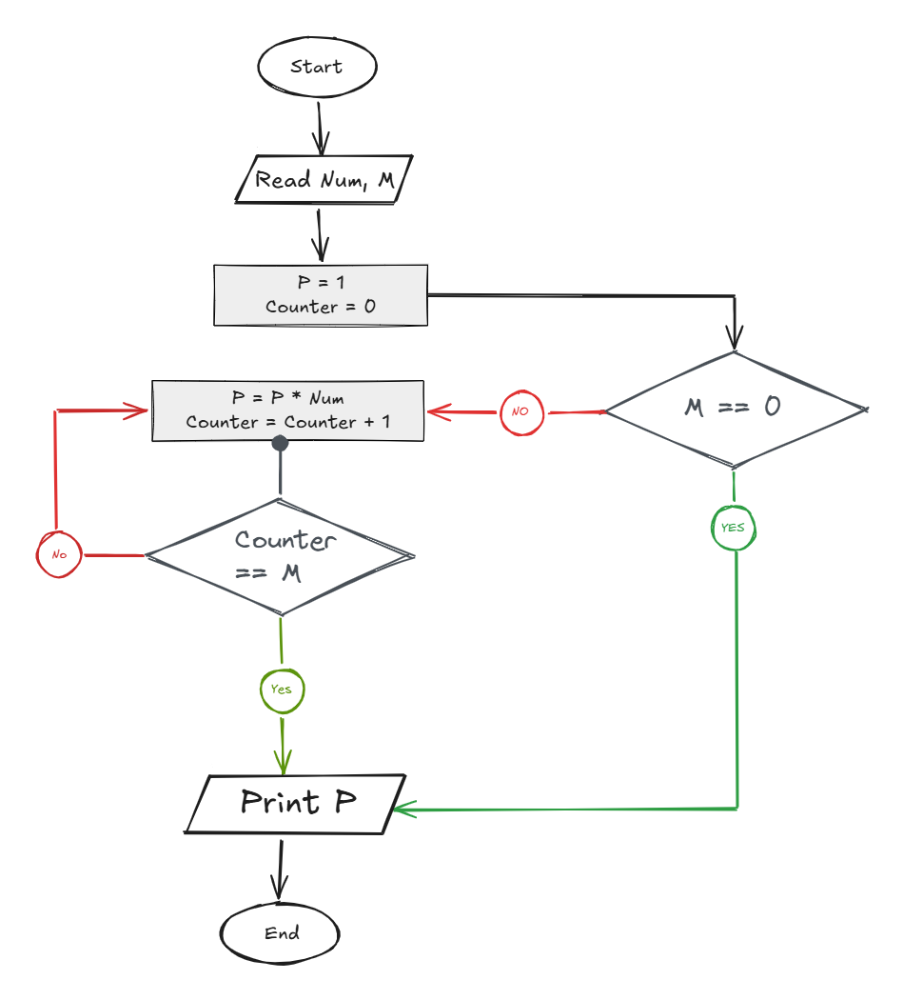

## Problem 32 - Power of M

### Problem

Write a program to ask the user to enter a number and a power `M`, then calculate and print `Number^M`.

- **Inputs:** `Num`, `M`
    
- **Output:** `Num^M`
    
- **Example Input:** `Num = 2`, `M = 4`
    
- **Example Output:** `16`
    

### Algorithm

1. Start.
    
2. Read `Num` and `M`.
    
3. Set `P = 1`.
    
4. Set `Counter = 0`.
    
5. Check if `Counter == M`.
    
    - **Yes:** Print `P` and end.
        
    - **No:** Continue.
        
6. Calculate:  
    `P = P * Num`
    
7. Increase `Counter` by `1`.
    
8. Go back to step 5.
    
9. End.
    

### Flowchart

