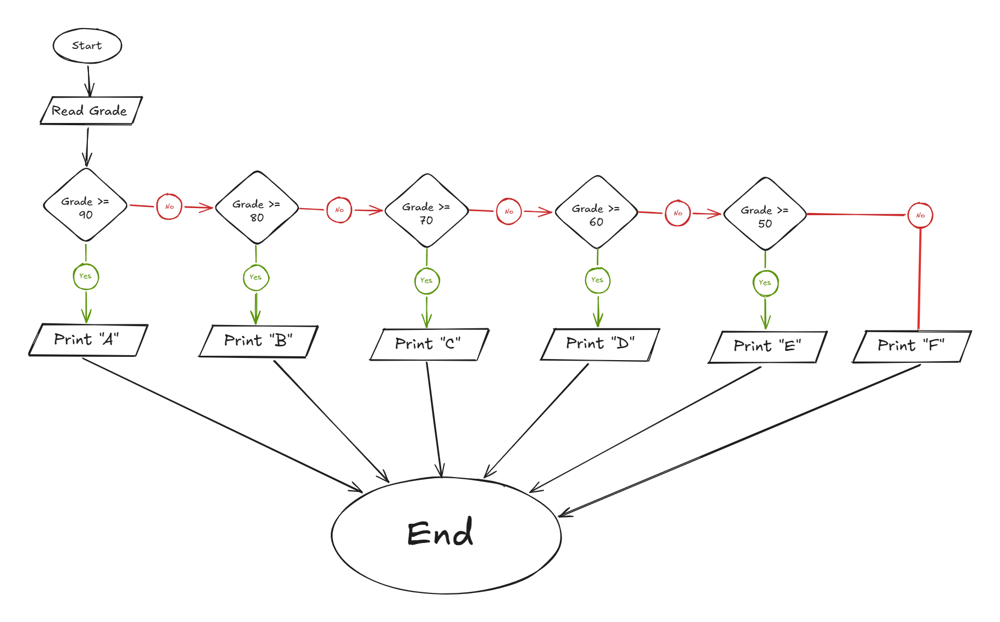

## Problem 33 - Grade A, B, C, D, E, F

### Problem

Write a program to ask the user to enter a grade, then print the corresponding letter grade according to the following ranges:

- `90 - 100` → Print `A`
    
- `80 - 89` → Print `B`
    
- `70 - 79` → Print `C`
    
- `60 - 69` → Print `D`
    
- `50 - 59` → Print `E`
    
- Otherwise → Print `F`
    
- **Input:** `Grade`
    
- **Output:** The corresponding letter grade
    
- **Example Input:** `95`
    
- **Example Output:** `A`
    

### Algorithm

1. Start.
    
2. Read `Grade`.
    
3. Check if `Grade >= 90`.
    
    - **Yes:** Print `"A"`.
        
    - **No:** Check if `Grade >= 80`.
        
4. If `Grade >= 80`:
    
    - **Yes:** Print `"B"`.
        
    - **No:** Check if `Grade >= 70`.
        
5. If `Grade >= 70`:
    
    - **Yes:** Print `"C"`.
        
    - **No:** Check if `Grade >= 60`.
        
6. If `Grade >= 60`:
    
    - **Yes:** Print `"D"`.
        
    - **No:** Check if `Grade >= 50`.
        
7. If `Grade >= 50`:
    
    - **Yes:** Print `"E"`.
        
    - **No:** Print `"F"`.
        
8. End.
    

### Flowchart

