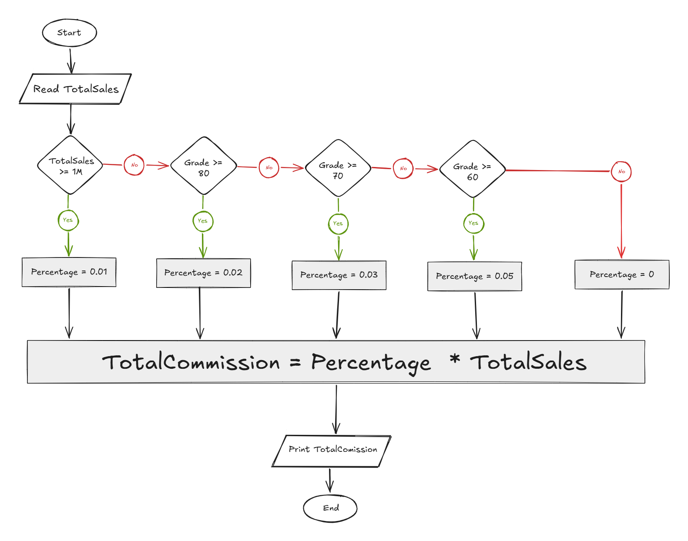

## Problem 34 - Commission Percentage

### Problem

Write a program to ask the user to enter the total sales amount, then calculate the commission based on the following percentages:

- `TotalSales >= 1,000,000` → Percentage = `1%`
    
- `TotalSales >= 500,000` → Percentage = `2%`
    
- `TotalSales >= 100,000` → Percentage = `3%`
    
- `TotalSales >= 50,000` → Percentage = `5%`
    
- Otherwise → Percentage = `0%`
    

The commission is calculated as:

`TotalCommission = Percentage * TotalSales`

- **Input:** `TotalSales`
    
- **Output:** `TotalCommission`
    
- **Example Input:** `110,000`
    
- **Example Output:** `3,300`
    

### Algorithm

1. Start.
    
2. Read `TotalSales`.
    
3. Check if `TotalSales >= 1,000,000`.
    
    - **Yes:** Set `Percentage = 0.01`.
        
    - **No:** Check if `TotalSales >= 500,000`.
        
4. If `TotalSales >= 500,000`:
    
    - **Yes:** Set `Percentage = 0.02`.
        
    - **No:** Check if `TotalSales >= 100,000`.
        
5. If `TotalSales >= 100,000`:
    
    - **Yes:** Set `Percentage = 0.03`.
        
    - **No:** Check if `TotalSales >= 50,000`.
        
6. If `TotalSales >= 50,000`:
    
    - **Yes:** Set `Percentage = 0.05`.
        
    - **No:** Set `Percentage = 0`.
        
7. Calculate the total commission:  
    `TotalCommission = Percentage * TotalSales`
    
8. Print `TotalCommission`.
    
9. End.
    

### Flowchart

