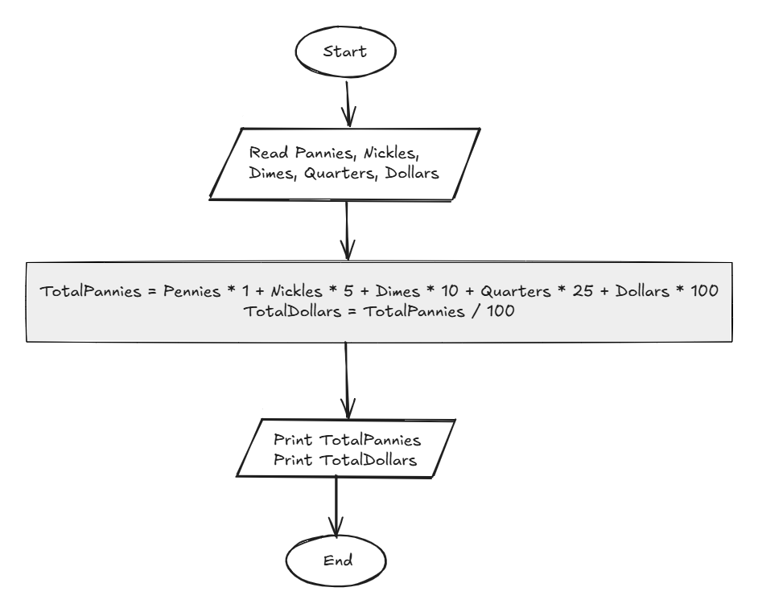

## Problem 35 - Piggy Bank Calculator

### Problem

Write a program to ask the user to enter the number of pennies, nickels, dimes, quarters, and dollars, then calculate the total amount in pennies and dollars.

The values of the coins are:

- `Penny = 1` penny
- `Nickel = 5` pennies
- `Dime = 10` pennies
- `Quarter = 25` pennies
- `Dollar = 100` pennies
- **Inputs:** `Pennies`, `Nickels`, `Dimes`, `Quarters`, `Dollars`
- **Outputs:** `TotalPennies`, `TotalDollars`
- **Example Input:** `5, 5, 5, 5, 5`
- **Example Output:** `705 Pennies`, `7.05 Dollars`

### Algorithm

1. Start.
2. Read `Pennies`, `Nickels`, `Dimes`, `Quarters`, and `Dollars`.
3. Calculate the total amount in pennies:  
   `TotalPennies = Pennies * 1 + Nickels * 5 + Dimes * 10 + Quarters * 25 + Dollars * 100`
4. Calculate the total amount in dollars:  
   `TotalDollars = TotalPennies / 100`
5. Print `TotalPennies`.
6. Print `TotalDollars`.
7. End.

### Flowchart

